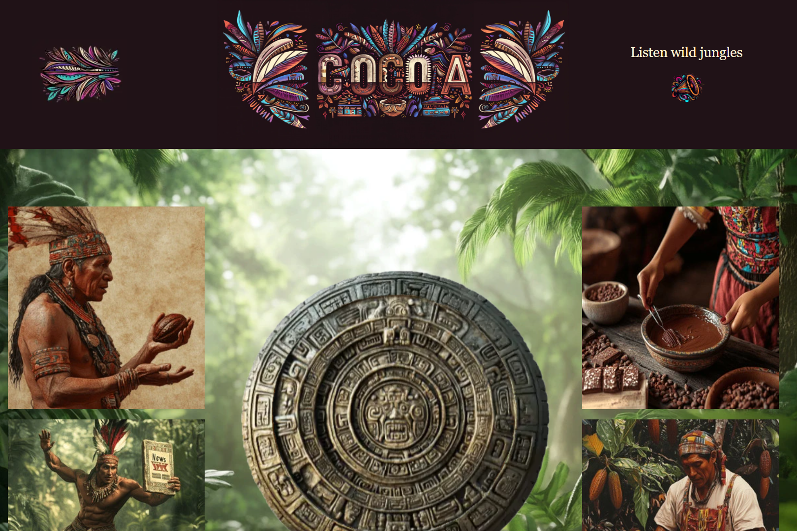
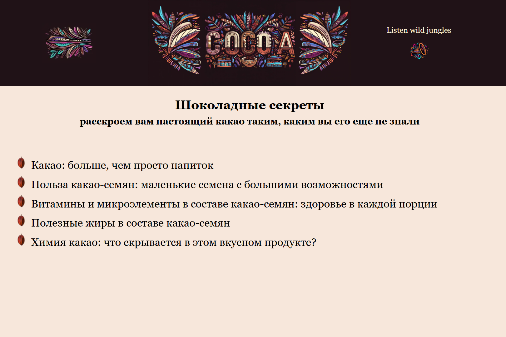
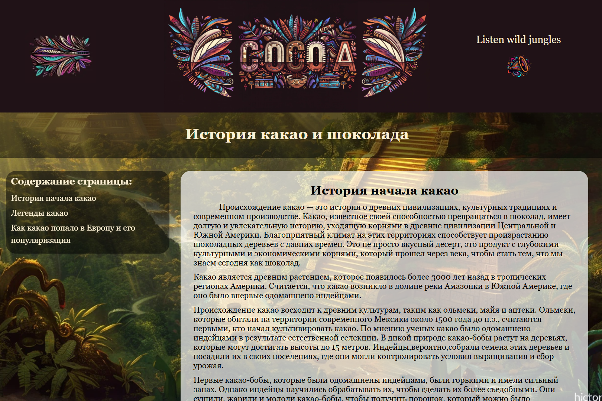
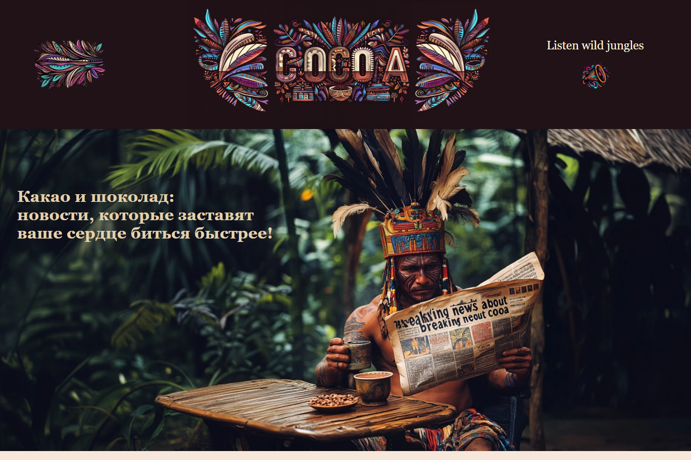
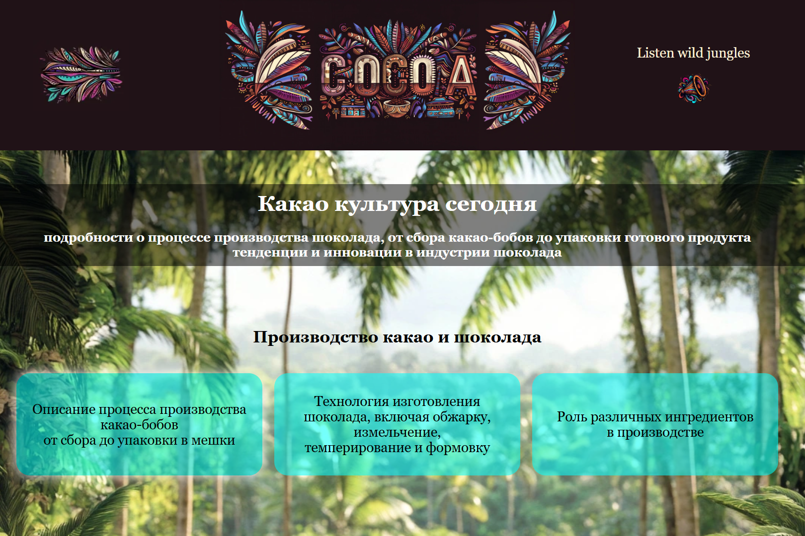
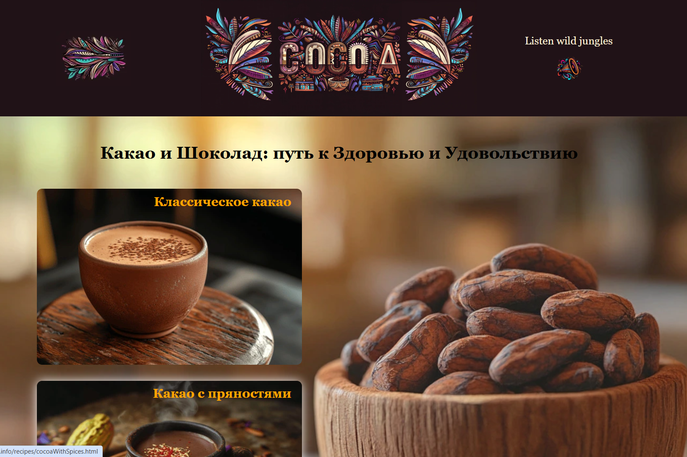

# Cocoa 

🌿 Проект "Какао и Шоколад" 🍫

## 📖 Описание проекта / Description of the project
Проект "Какао и Шоколад" — это информационный сайт, посвященный удивительному миру какао и шоколада. Здесь пользователи могут погрузиться в историю какао, узнать о его пользе и роли в культуре, следить за последними новостями и находить рецепты для здоровья и удовольствия.
The Cocoa and Chocolate Project is an information website dedicated to the amazing world of cocoa and chocolate. Here, users can immerse themselves in the history of cocoa, learn about its benefits and role in culture, follow the latest news and find recipes for health and pleasure.

🌟 Основные разделы сайта / The main sections of the site

**Главная страница** — интерактивный переход к разделам сайта. / 
**The main page** is an interactive navigation to the sections of the site.


**Шоколадные секреты** — раскрывает тайны состава шоколада и его влияние на организм. /
**Chocolate secrets** — reveals the secrets of the composition of chocolate and its effect on the body.


**История какао** — погружение в древние традиции майя и ацтеков. /
**The history of cocoa** is an immersion in the ancient traditions of the Maya and the Aztecs.


**Какао новости** — свежие новости о производстве и потреблении какао. /
**Cocoa news** — latest news about cocoa production and consumption.


**Культура какао сегодня** — современные тенденции и инновации в индустрии. /
**Cocoa culture today** — current trends and innovations in the industry.


**Рецепты** — идеи для приготовления полезных и вкусных напитков и десертов. /
**Recipes** are ideas for making healthy and delicious drinks and desserts.



Я разработала и реализовала этот сайт с нуля: от идеи и дизайна до программирования и публикации. Использовала HTML, CSS и JavaScript для создания адаптивного интерфейса и интерактивных элементов.
Были выполнены задачи:
- Самостоятельно разработала идею сайта о шоколаде, включая его цели, аудиторию и функциональные требования.
- Создала структуру страниц и логическую навигацию.
- Создала дизайн интерфейса, включая цветовую палитру, шрифты и стилистику.
- Написала весь код сайта с использованием HTML, CSS и JavaScript.
- Реализовала адаптивную верстку, чтобы сайт корректно отображался на разных устройствах (мобильные, планшеты, десктопы).
- Настроила взаимодействия с мультимедиа (аудио и изображения).
- Внедрила интерактивные элементы: выпадающие меню с анимацией и визуализации.
- Написала текстовый контент для сайта.
- Добавила изображения, полностью адаптированные для нужд проекта.
- Разместила сайт на хостинге и провела проверку его функциональности.

I developed and implemented this website from scratch: from the idea and design to programming and publishing. I used HTML, CSS, and JavaScript to create a responsive interface and interactive elements.
The tasks were completed:
- Independently developed the idea of a chocolate website, including its goals, audience, and functional requirements.
- Created the page structure and logical navigation.
- Created the interface design, including the color palette, fonts and stylistics.
- I wrote the entire website code using HTML, CSS and JavaScript.
- Implemented adaptive layout so that the site is displayed correctly on different devices (mobile, tablets, desktops).
- Set up interactions with multimedia (audio and images).
- Implemented interactive elements: drop-down menus with animations and visualizations.
- I wrote text content for the website.
- Added images that are fully adapted to the needs of the project.
- I hosted the website and checked its functionality.


# 💪 Часть задач, которые я выполнила и способы их решения. / Some of the tasks that I have completed and the ways to solve them.
1. Анимация заставки и плавный переход к контенту страницы сайта об истории Какао и Шоколада.
Задача: создать интерактивную заставку при загрузке страницы с возможностью её пропуска. 
Решение: использованы таймеры setTimeout() для последовательного появления элементов и функция, позволяющая по клику на кнопку пропустить заставку, с последующим удалением таймеров через clearTimeout().
Animation of the screensaver and smooth transition to the content of the website page about the history of Cocoa and Chocolate.
Task: to create an interactive splash screen when loading a page with the ability to skip it. 
Solution: setTimeout() timers are used to sequentially display elements and a function that allows you to skip the splash screen by clicking on the button, followed by deleting the timers via clearTimeout().

```js
    const zoomWallpaper = setTimeout(() => {
        const img = document.querySelector(".wallpaper__img");
        img.classList.add("zoom-in");
        headerEL.style.display = 'none';
    }, 7000);

    buttonEl.addEventListener('click', function () {
        wallpaperBlock.style.display = 'none';
        clearTimeout(zoomWallpaper);
    });
```

2.  Аудиоплеер с кастомным управлением.
Задача: добавить возможность проигрывания звука джунглей при клике по иконке и его остановку при двойном клике.
Решение: использованы встроенные методы аудио-объекта (play(), pause()).
An audio player with custom controls.
Task: add the ability to play the jungle sound when clicking on the icon and stop it when double-clicking.
Solution: the built-in audio object methods (play(), pause()) are used.

```js
    const soundIcon = document.querySelector('.music__img');
    soundIcon.addEventListener('click', () => document.querySelector('audio').play());
    soundIcon.addEventListener('dblclick', () => document.querySelector('audio').pause());
```

3. Раскрытие раздела блока для чтения подробной информации.  
Задача: реализовать функциональность для списка, где при нажатии на элемент блока он раскрывается и отображается подробная информация. Закрывать информационный блок, щелкая вне элемента блока или на кнопку закрытия. В мобильной адаптации экрана пользователь должен иметь возможность прокручивать содержимое, возвращаться к верхней части с помощью кнопки "Назад к верху".
Opening a section of the block to read detailed information.  
Task: to implement the functionality for the list, where when you click on a block element, it opens and detailed information is displayed. Close the information block by clicking outside the block element or on the close button. In the mobile adaptation of the screen, the user should be able to scroll through the content, return to the top using the "Back to top" button.

```js
        function toTopAndClose(array) {
            array.forEach(item => {
                item.addEventListener('click', (e) => {

                    const articleFull = item.querySelector('.article-full');
                    articleFull.style.display = 'flex';

                    const backToTop = articleFull.querySelector(".backToTop");
                    articleFull.addEventListener("scroll", function () {
                        if (articleFull.scrollTop > 300 && window.innerWidth <= 767) {
                            backToTop.style.display = "block";
                        } else {
                            backToTop.style.display = "none";
                        }
                    });

                    backToTop.addEventListener("click", function (event) {
                        event.stopPropagation();
                        event.preventDefault();
                        articleFull.scrollTo({ top: 0, behavior: "smooth" });
                    });

                    document.addEventListener('click', function (event) {
                        event.stopPropagation();
                        if (!articleFull.contains(event.target) && !item.contains(event.target)) {
                            articleFull.style.display = 'none';
                        }
                    });

                    const closeButton = articleFull.querySelector('.article-button');
                    closeButton.addEventListener('click', () => {
                        event.stopPropagation();
                        articleFull.style.display = 'none';
                    });
                })
            })
        }
```

## Технологии / Technologies

* HTML5 — для создания семантически правильной разметки страницы.
* CSS3 — для стилизации, включая адаптивную верстку и анимации (например, эффекты появления и увеличения изображений).
* JavaScript (Vanilla JS) — для добавления интерактивности: открытие/закрытие меню, анимация элементов, работа с аудио и плавная прокрутка страницы.
* WebGL — для создания 3D-анимации огненного кольца календаря майя.
* Picture и srcset — для поддержки адаптивных изображений с webp.

* HTML5 — to create semantically correct page markup.
* CSS3 — for styling, including adaptive layout and animations (for example, effects of appearance and magnification of images).
* JavaScript (Vanilla JS) — to add interactivity: opening/closing menus, animating elements, working with audio and smooth scrolling of the page.
* WebGL — to create a 3D animation of the ring of fire of the Mayan calendar.
* Picture and srcset — to support adaptive images from webp.


## 🔥 Установка и запуск / Installation and launch

Откройте [сайт](https://cocoauniverse.info/) и наслаждайтесь или склонируйте репозиторий:
Open [website](https://cocoauniverse.info /) and enjoy or clone the repository:
``` bash
    git clone https://github.com/ваш-аккаунт/cocoa-and-chocolate.git
```
Откройте файл index.html в браузере.
Open the file index.html in the browser.